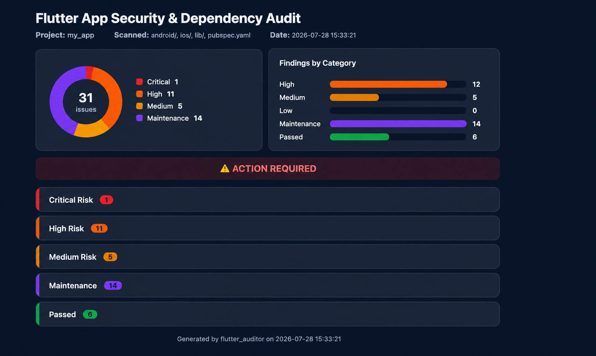

# flutter_auditor

A command-line project-health audit tool for Flutter projects. Point it at
a Flutter project and it scans the Android manifest, iOS `Info.plist`,
Dart source, and `pubspec.yaml`/`pubspec.lock` — covering security
misconfigurations, dependency hygiene, and project hygiene (unused assets,
unused dependencies) in one pass, one command, no project modification.

## Why flutter_auditor?

`flutter_auditor` audits the parts of a Flutter project most single-purpose
tools don't look at together: platform configuration files
(`AndroidManifest.xml`, Network Security Config, `Info.plist`), Dart
source, and `pubspec.yaml`/`pubspec.lock` — in one pass, instead of
stitching together several tools each covering one slice.

- **Platform-config aware, not just source-aware** — most Dart analyzers
  only look at `.dart` files. `flutter_auditor` also parses
  `AndroidManifest.xml`, the Android Network Security Configuration, backup
  rules XML, and iOS `Info.plist` — the files where most real-world
  Android/iOS misconfigurations actually live (`allowBackup`, exported
  components, ATS exceptions, missing usage descriptions).
- **No upload, no account, no server** — everything runs against files on
  disk, locally. The only network calls are read-only lookups to the public
  pub.dev API for dependency metadata (outdated/discontinued/license
  checks); your source code never leaves your machine.
- **Actionable, not just diagnostic** — every finding ships with a
  severity, the exact file (and line, where applicable), a plain-language
  description, and a concrete fix — not just a rule ID to go look up.
- **Multiple categories in one pass** — security misconfigurations,
  dependency hygiene (outdated, discontinued, restricted-license, unused),
  and project hygiene (unused assets) today, with more categories planned,
  instead of needing a separate tool per concern.
- **Suppressible without going silent** — a `.flutter_auditor_ignore.yaml`
  file lets you accept known findings by audit, id, or file glob; the
  console always reports how many findings were suppressed, so nothing
  disappears quietly.
- **CI-friendly by default** — a single exit code (`--fail-on`) gates your
  pipeline; a shareable HTML report (`--html`) with charts is there when
  you want something to hand to a non-technical stakeholder; `--json` and
  `--sarif` cover machine consumption, with SARIF dropping straight into
  GitHub code scanning as PR-line annotations.
- **Adoptable on a legacy codebase without a big-bang cleanup** —
  `--update-baseline` snapshots existing findings so CI only fails on
  newly introduced ones, instead of forcing a five-year-old app to fix
  everything before the tool can be turned on.

## Installation

```bash
dart pub global activate flutter_auditor
```

Or run it from source without installing:

```bash
dart run bin/flutter_auditor.dart audit
```

## Usage

Run from the root of the Flutter project you want to audit:

```bash
flutter_auditor audit
```

### Options

| Flag | Description |
| --- | --- |
| `-v`, `--verbose` | Show full detail for low-risk and maintenance findings (collapsed by default). |
| `--fail-on <severity>` | Minimum severity that causes a non-zero exit code: `critical`, `high` (default), `medium`, `low`, `info`, or `none`. |
| `--html <path>` | Write an HTML report (with charts) to the given path, e.g. `--html audit_report.html`. |
| `--open` | Open the generated HTML report in the default browser after writing it. |
| `--json <path>` | Write a JSON report to the given path. |
| `--sarif <path>` | Write a SARIF 2.1.0 report to the given path — drop it straight into GitHub code scanning for PR-line annotations. |
| `--update-baseline` | Write current findings to `.flutter_auditor_baseline.json` as the accepted baseline, then exit. See [Adopting on an existing project](#adopting-on-an-existing-project). |

Example:

```bash
flutter_auditor audit --html audit_report.html --open --fail-on medium
```

### Adopting on an existing project

Running this against a project for the first time can surface a lot of
pre-existing findings — enough that nobody wants to triage them all before
turning on CI enforcement. Bootstrap a baseline instead:

```bash
flutter_auditor audit --update-baseline
```

This writes every current finding to `.flutter_auditor_baseline.json` as a
set of fingerprint strings, one per finding.

#### How a finding is classified as new vs. pre-existing

Each fingerprint is built from three things: `<audit id>|<file path>|<description>`
— e.g. `android_debuggable|android/app/src/main/AndroidManifest.xml|The
application is debuggable...`. Deliberately **not** line number or byte
offset: those shift whenever someone edits unrelated code above the
finding, which would make the baseline silently stop matching findings it
should still cover.

On every subsequent run, each finding's fingerprint is computed the same
way and checked against the baseline set — if it's in the set, the
finding is **pre-existing**; if not, it's **new**. There's no timestamp
or git history involved, just a direct set-membership check against
whatever was true the last time someone ran `--update-baseline`.

One consequence worth knowing: if a pre-existing issue gets fixed and is
later reintroduced, it'll be classified as **new** again — the baseline
only remembers what existed at the moment it was written, not "seen once,
forever excused." Re-run `--update-baseline` deliberately whenever you
want to update what counts as known.

From then on, a normal `flutter_auditor audit` run treats baselined
findings as accepted (never failing the build a second time), but *how*
they're accepted depends on severity:

- **Critical/high** findings stay visible in the report — a serious
  finding doesn't silently disappear just because it's pre-existing, so
  it keeps getting seen every run until someone actually fixes it. Newly
  introduced findings print first, unmarked; pre-existing ones follow
  under a `── Pre-existing (baselined, non-blocking) — N ──` divider, so
  the two are never mixed together. The summary line breaks this down too:
  `High Risk : 2   (1 new, 1 pre-existing)`.
- **Medium/low/info** findings are fully hidden, the same as a suppressed
  finding.
- **Maintenance findings** (outdated/unused dependencies, unused or
  overlarge assets) always stay visible in the Maintenance section
  regardless of severity, baselined or not — they never affect the exit
  code either way, so there's nothing for the baseline to protect them
  from, and hiding them would just make dependency/asset hygiene reports
  vanish the moment you run `--update-baseline`.

The console always reports how many were accepted
(`ⓘ N pre-existing finding(s) accepted via .flutter_auditor_baseline.json
(M critical/high still shown, non-blocking)`), so the baseline's effect is
never a mystery. Commit the baseline file so CI and every contributor
share the same accepted state.

### Suppressing findings

Add a `.flutter_auditor_ignore.yaml` file to the root of the project being
audited to suppress specific findings — by audit, by exact issue id, or by
a file glob (matched relative to the project root):

```yaml
# .flutter_auditor_ignore.yaml
audits:
  - android_release_signing   # suppress every finding from this audit

ids:
  - android.allow_backup      # suppress one specific, stable finding id

files:
  - test/fixtures/**          # suppress every finding under this path
```

Suppressed findings are never silently dropped — the console output shows
how many were suppressed (`ⓘ N finding(s) suppressed by
.flutter_auditor_ignore.yaml`) before the report.

## What it checks

**Android**
- `android:allowBackup` enabled
- Cleartext (HTTP) traffic permitted
- Exported activities, services, receivers, and providers
- `android:debuggable` enabled
- Manifest permissions (high/medium risk)
- Network Security Configuration (cleartext traffic, trusted user certificates)
- Missing or misconfigured backup rules / data extraction rules
- Release builds signed with the debug key, hardcoded signing credentials in `build.gradle`, and an un-gitignored `key.properties`
- Release builds not minified/obfuscated (`minifyEnabled`/R8), and scripted `flutter build` release commands missing `--obfuscate`

**iOS**
- App Transport Security exceptions (arbitrary loads, weak minimum TLS version)
- `UIFileSharingEnabled` exposing the Documents directory
- Missing, empty, or mismatched usage-description strings (camera, location, etc.)
- Privacy manifest (`PrivacyInfo.xcprivacy`): required-reason APIs used by the app's own native code but not declared (App Store rejection ITMS-91053), invalid reason codes, a manifest missing from the Xcode project, and tracking enabled without tracking domains

**Cross-platform (Dart source)**
- Hardcoded secrets (API keys, tokens, credentials, private keys)
- Insecure network usage (cleartext URLs, disabled certificate validation, WebView SSL bypass)
- Insecure storage (sensitive data in `SharedPreferences` or unencrypted Hive boxes)

**Dependencies**
- Outdated, discontinued, or unlicensed/restricted-license packages
- An outdated Dart SDK constraint (pre-null-safety)
- Dependencies declared in `pubspec.yaml` but never imported

**Assets**
- Assets declared in `pubspec.yaml` but never referenced in Dart source
- Assets large enough to meaningfully bloat the app bundle (≥1 MB medium, ≥5 MB high)

## Example output

```
╔══════════════════════════════════════════════════════════════╗
║              FLUTTER APP SECURITY & DEPENDENCY AUDIT         ║
╚══════════════════════════════════════════════════════════════╝

📁 Project   : my_app
📄 Scanned   : android/, ios/, lib/, pubspec.yaml
🕐 Date      : 2026-07-29 12:52:25

──────────────────────────────────────────────────────────────────
 SUMMARY
──────────────────────────────────────────────────────────────────
  ✗  High Risk        : 2
  ⚠  Medium Risk       : 3
  ⚠  Low Risk          : 1
  ⓘ  Maintenance       : 2   (outdated/unused deps, licenses)
  ✔  Passed Checks     : 11

  Overall Status: ⚠️  ACTION REQUIRED (high-risk issues present)

──────────────────────────────────────────────────────────────────
 ✗ HIGH RISK (2)
──────────────────────────────────────────────────────────────────

[1] Android Backup Enabled
    📍 android/app/src/main/AndroidManifest.xml
    ⚠️  The application allows Android backups.
    ✅ Fix: Set android:allowBackup="false" in AndroidManifest.xml.

[2] Exported Activity
    📍 android/app/src/main/AndroidManifest.xml
    ⚠️  Activity ".MainActivity" is exported and may be accessible by other applications.
    ✅ Fix: Ensure this Activity is exported only when required and protected with appropriate permissions.

──────────────────────────────────────────────────────────────────
 ✔ PASSED (11)
──────────────────────────────────────────────────────────────────
  ✔ Hardcoded Secrets Detection — no issues found
  ✔ Insecure Storage Detection — no issues found
  ✔ App Transport Security Audit — no issues found
  ...

══════════════════════════════════════════════════════════════════
  Scan complete: 2 high, 3 medium, 1 low, 2 maintenance item(s).
  Exit code: 1 (high-risk issues present — see --fail-on to adjust)
══════════════════════════════════════════════════════════════════
```

The `--html` report shows the same findings with a severity chart:



## Exit codes

`0` if no issue meets the `--fail-on` threshold, `1` otherwise. Maintenance
findings (outdated/unused dependencies) never affect the exit code. Invalid
command-line usage exits with `64`.

## GitHub Actions

Run the audit on every push and pull request, with findings shown as
code scanning alerts and PR-line annotations:

```yaml
# .github/workflows/flutter_auditor.yml
name: Flutter Auditor

on:
  push:
    branches: [main]
  pull_request:

permissions:
  contents: read
  security-events: write # needed to upload SARIF to code scanning

jobs:
  audit:
    runs-on: ubuntu-latest
    steps:
      - uses: actions/checkout@v4
      - uses: thakaredipali/flutter_auditor@v1
        with:
          fail-on: high
```

| Input | Default | Description |
| --- | --- | --- |
| `working-directory` | `.` | Directory containing the app's `pubspec.yaml`. |
| `fail-on` | `high` | Minimum severity that fails the step (`none` to never fail). |
| `upload-sarif` | `true` | Upload findings to GitHub code scanning. |
| `sarif-category` | `flutter_auditor` | Code scanning category — set a distinct one per project when auditing several in one repo. |
| `args` | | Extra arguments for `flutter_auditor audit`, e.g. `--verbose`. |

The SARIF report is uploaded even when the audit fails, so annotations
appear on exactly the runs where they matter. Code scanning is free for
public repositories; private repositories need GitHub Advanced Security
(set `upload-sarif: false` otherwise). Findings' file paths are relative
to `working-directory`, so PR-line annotations line up when it is the
repository root.

## License

MIT — see [LICENSE](LICENSE).
